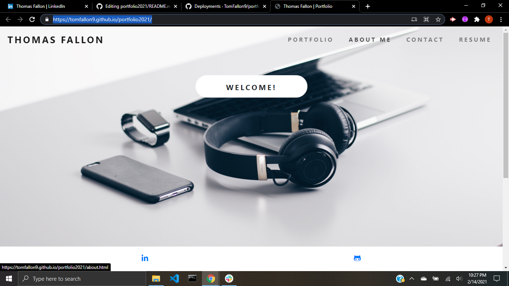

# Portfolio

## Table of Contents 

* [Description](#description)
* [Built With](#built-with)
* [Screenshot](#screenshot)
* [Live](#Live)

## Description
Portfolio with my latest builds and projects 2021 

## Built With

* [HTML](https://html.spec.whatwg.org/) - Markup language used to define the structure of webpage.

## Live 
[Portfolio](https://tomfallon9.github.io/portfolio2021/)
